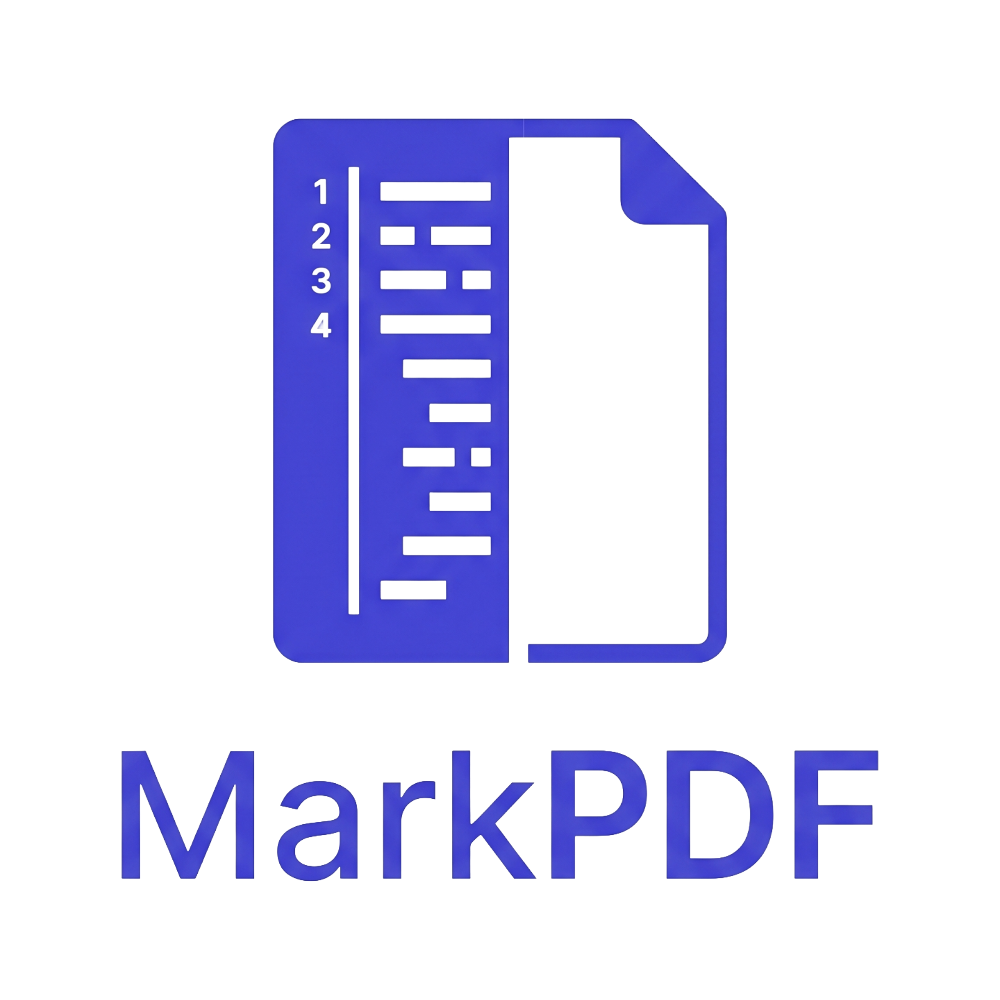

<div align="center">
  
  <h1>📄 MarkPDF</h1>

  <p><strong>Turn your notes into professional PDFs instantly, entirely in your browser.</strong></p>

  [](https://opensource.org/licenses/MIT)
  [](https://github.com/dhaatrik/free-markdown-to-pdf-converter/actions/workflows/ci.yml)
  [](https://react.dev/)
  [](https://vitejs.dev/)
  [](https://tailwindcss.com/)
</div>

<br />

## 📖 Introduction

Welcome to **MarkPDF**! This is a simple, free, and privacy-focused web tool designed to bridge the gap between note-taking and professional document generation. It allows you to write text using standard Markdown and converts it into beautifully formatted PDF documents in real time. 

**Why MarkPDF?** Standard markdown editors are excellent for writing, but exporting to a clean, styled PDF often requires paid software, cloud conversions, or complex terminal tools like Pandoc. MarkPDF solves this by handling the entire rendering and export process directly in your browser.

- 🔒 **Privacy First**: No backends, no cloud uploads, and no sign-ups. Your sensitive documents never leave your local device.
- ⚡ **Lightning Fast**: Built on modern web technologies, the live preview renders instantly as you type.

---

## 📑 Table of Contents

- [Features](#-features)
- [Technologies Used](#-technologies-used)
- [System Requirements](#️-system-requirements)
- [Installation & Setup](#-installation--setup)
- [Usage Instructions](#-usage-instructions)
- [Testing Instructions](#-testing-instructions)
- [Contribution Guidelines](#-contribution-guidelines)
- [License](#-license)

---

## 🌟 Features

- **✍️ Live Split-Pane Editor**: Write in a distraction-free, syntax-highlighted editor featuring line numbers.
- **👁️ Real-time Preview**: See your document transform into a styled PDF instantly.
- **🎨 Extensive Customization**: Customize typography (Serif, Sans-Serif, Monospace), text colors, background colors, and page margins to fit your exact needs.
- **💻 Syntax Highlighting**: Automatic deep-coloring for code blocks with dynamic light/dark code themes—perfect for technical documentation.
- **📱 Responsive & Accessible**: Works beautifully across desktops, tablets, and mobile phones with full dark mode support.
- **🖨️ Native Print Engine**: Uses the browser's highly optimized print engine to generate pristine vector PDFs without relying on bloated canvas workarounds.

---

## 🛠 Technologies Used

MarkPDF is built with a modern, high-performance web development stack:

- **[React 19](https://react.dev/)**: For building a responsive, state-driven user interface.
- **[Vite](https://vitejs.dev/)**: Providing an ultra-fast development server and optimized production builds.
- **[Tailwind CSS v4](https://tailwindcss.com/)**: For rapid, utility-first UI styling and dark mode handling.
- **[React-Markdown](https://github.com/remarkjs/react-markdown) & [Remark-GFM](https://github.com/remarkjs/remark-gfm)**: For safely parsing and rendering GitHub Flavored Markdown.
- **[React-Syntax-Highlighter](https://github.com/react-syntax-highlighter/react-syntax-highlighter)**: For robust code block highlighting.
- **[Vitest](https://vitest.dev/) & [React Testing Library](https://testing-library.com/)**: For fast, reliable component and unit testing.

---

## ⚙️ System Requirements

To run this project locally, you will need:
- **Node.js** (v18.0 or higher recommended)
- **npm** (v9.0 or higher)
- A modern web browser (Chrome, Firefox, Safari, Edge)

---

## 🚀 Installation & Setup

1. **Clone the repository:**
   ```bash
   git clone https://github.com/dhaatrik/free-markdown-to-pdf-converter.git
   cd free-markdown-to-pdf-converter
   ```

2. **Install all dependencies:**
   ```bash
   npm install
   ```

3. **Start the local development server:**
   ```bash
   npm run dev
   ```

4. **Access the Application:**
   Open your browser and navigate to the URL provided in your terminal (typically `http://localhost:3000`).

### 📦 Building for Production

To compile an optimized, minified production build:
```bash
npm run build
```
This will generate a `dist` folder containing static files that can be deployed to any static host (Vercel, Netlify, GitHub Pages).

---

## 💡 Usage Instructions

### Writing & Formatting
1. Focus the editor pane on the left side of the screen.
2. Use standard Markdown to format your text. You can also click the quick-insert buttons on the **Toolbar** to easily add bolding, quotes, code blocks, lists, and images.
3. Utilize GitHub Flavored Markdown features (like tables and task lists) out of the box!

### Document Customization
Click the **Settings (⚙️)** icon in the top right header to adjust your PDF's appearance:
- **Typography**: Dynamically switch the active font family.
- **Metrics**: Tweak the font size and the exact document margins (in millimeters).
- **Branding**: Set specific textual hex colors for both text and background.
- **Themes**: Toggle the code block syntax style between Light and Dark modes.

### Exporting the PDF
Once you're satisfied with the preview on the right pane:
1. Click the **Export PDF** button.
2. The browser's native print dialog will appear. Ensure the "Destination" is set to **"Save as PDF"**.
3. *Tip:* Ensure the scale is set to `100%` and "Background graphics" is enabled if you are using custom colors.

---

## 🧪 Testing Instructions

MarkPDF maintains a suite of automated unit tests to ensure UI reliability and code quality.

**Run isolated tests:**
```bash
npm run test
```
*This performs a single-run test sequence utilizing Vitest.*

**Run the linting pipeline:**
```bash
npm run lint
```
*This verifies code quality utilizing ESLint and Flat Configs to prevent hidden type logic errors.*

---

## 🤝 Contribution Guidelines

Contributions, issues, and feature requests are highly encouraged! Whether you're fixing a bug, adding a feature, or improving documentation, we'd love your help.

1. **Fork the project** to your GitHub account.
2. **Create your feature branch** (`git checkout -b feature/AmazingFeature`).
3. **Commit your changes** descriptively (`git commit -m 'Add AmazingFeature'`). Ensure you run tests and linters beforehand!
4. **Push to the branch** (`git push origin feature/AmazingFeature`).
5. **Open a Pull Request** against the `main` branch.

Please review our [CONTRIBUTING.md](./CONTRIBUTING.md) for more elaborate details.

---

## 📄 License

This project is open-source and is licensed under the [MIT License](./LICENSE). You are free to use, modify, and distribute this software as you see fit.
